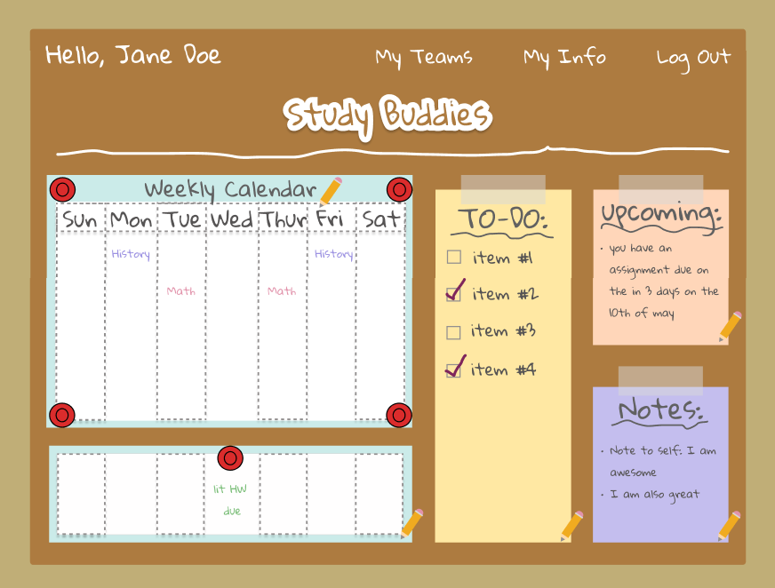
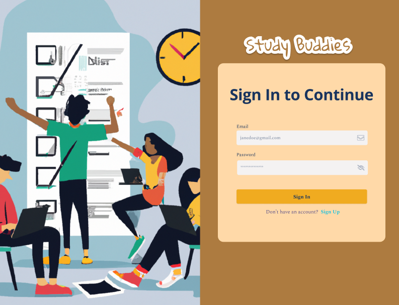
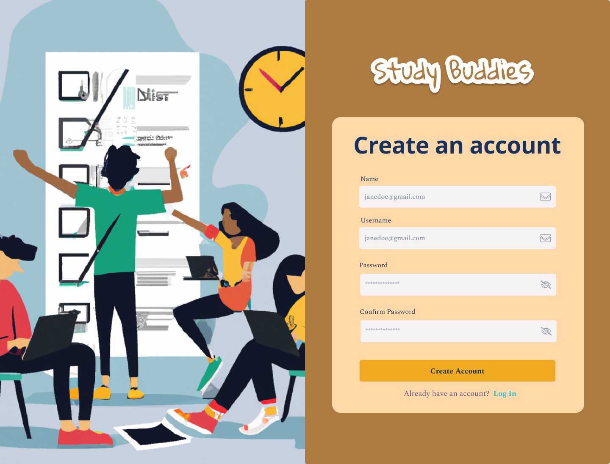
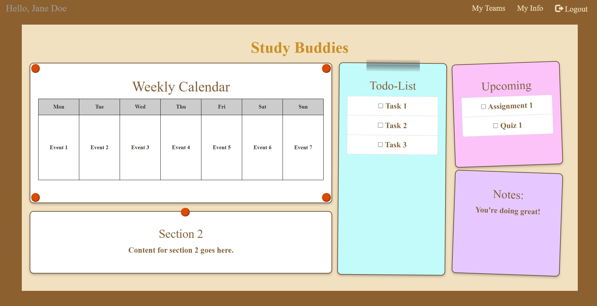
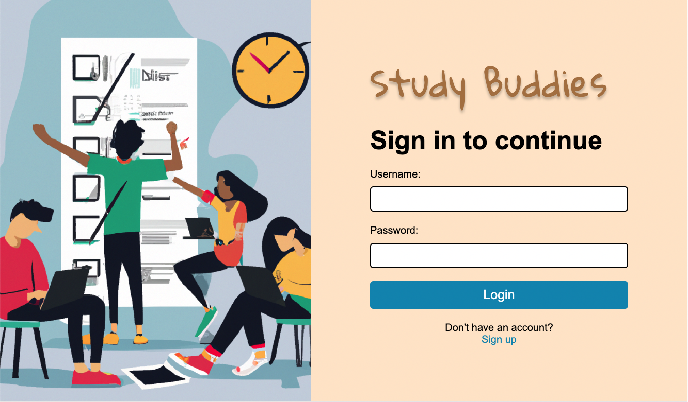
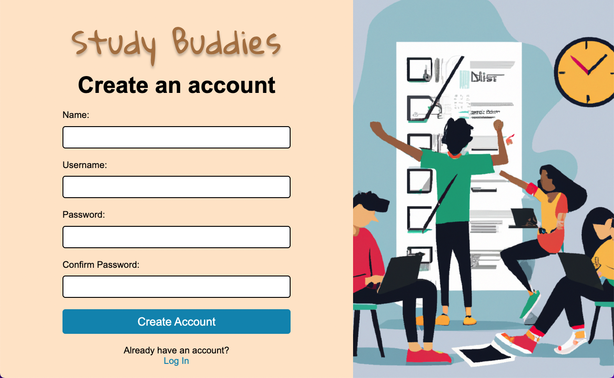

# UI Design

## Wireframe

Here we outline the three main views of our site: an individual view, login page and sign up page. As stretch goals, we may also implement a team view, which will be based off of the individual view.

### Individual View

This is the individual view that a user sees after signing in. By clicking on "My Teams" an individual user can then get to a team view which has all of the same main components as individual view, except that a team view is shared between everyone on that team (and likewise is accessible by clicking "My Teams" on their end as well). Since our application is for students to manage their workflow, we decided to use a bulletin board theme for our UI design. chose Each component a user interacts with is visually equivalent to something "adhered" to this board. We use pencil icons to allow users to edit components (ie: add a to-do list item, change the due date of an assignment).

### Login Page

This is the login page that a user sees when they want to access the Studdy Buddies application. We also provide an option for creating a new account for new users.

### Create Account Page

This is the create account page that the user sees if they wish to make a new Study Buddies account.

## Stories

### Story 1

Jane's assignments are piling up and she wants to put them on her Study Buddies dashboard to help visualize her workload. From her individual dashboard, she is able to add assignments and deadlines either to her "To-do" list or to the weekly assignment view directly under her weekly calendar. Jane chooses to use the to-do list since she wants to write everything out quickly. Clicking on the edit button of the to-do list provides a pop-up window where Jane must specify the name of her assignment/ deadline, and then can also choose to provide the associated class if applicable, a short description, and a due date. Jane has an exercise for CS 326 due on Tuesday, and she wants to remember what material to reference in the exercise so she writes a note in the description saying to look back at the lecture on local sotrage.

### Story 2

Assignments and to-do list items created on Studdy Buddies have an option to provide a due date, and the Upcoming component uses due dates to provide reminders. But Jane wants somewhere to dump thoughts or ideas and not have them be managed by deadlines or be grouped in with the rest of her productivity management. So she opts to create a note by selecting the "Notes" component in her individual view and typing in whatever comes to mind. Jane needs some motivation for the tough week ahead so she uses notes to remind herself to do her best.

### Story 3

\*Note: this story pertains to a stretch goal

Jane is in a CS 326 group project with classmates who also have Study Buddies accounts. She wants to create a shared team space for her and her group members to see the same project deadlines, schedules, and organize the project. From her own personal dashboard, Jane clicks on "My Teams" which takes her to the landing page for team-related content. Here she sees other teams she has made in the past, any team invitations, and an option to create a new team. She chooses to create a new team called "Best CS 326 Team" by clicking "+", entering the team name, and entering the emails her team members use for their Study Buddies accounts. This invites her members through their own dashboards, where they will see a new pending team from Jane in their "My Teams" view.

## HTML & CSS Mockup

Here are the HTML and CSS mockups of the three main views of our site: an individual view, login page and sign up page. As stretch goals, we may also implement a team view, which will be based off of the individual view.

### Individual View

This is the individual view that a user sees after signing in. By clicking on "My Teams" an individual user can then get to a team view which has all of the same main components as individual view, except that a team view is shared between everyone on that team (and likewise is accessible by clicking "My Teams" on their end as well). We plan to make the calender component more structured by adding time slots. Under the calendar, we have a component where weekly assignments and to-do items with deadlines will be displayed. In the future we plan to give this component a table structure like in the wireframe. Unlike the wireframe there are no pencil icons for accessing edit functionality here. We will figure out how to implement the code for an edit icon in the future.

### Login Page

This is the login page that a user sees when they want to access the Studdy Buddies application. We also provide an option for creating a new account for new users.

### Create Account Page

This is the create account page that the user sees if they wish to make a new Study Buddies account.

## References

- [Bootstrap card components](https://getbootstrap.com/docs/5.3/components/card/)
- [Bootstrap page templates](https://www.w3schools.com/bootstrap/bootstrap_templates.asp)
